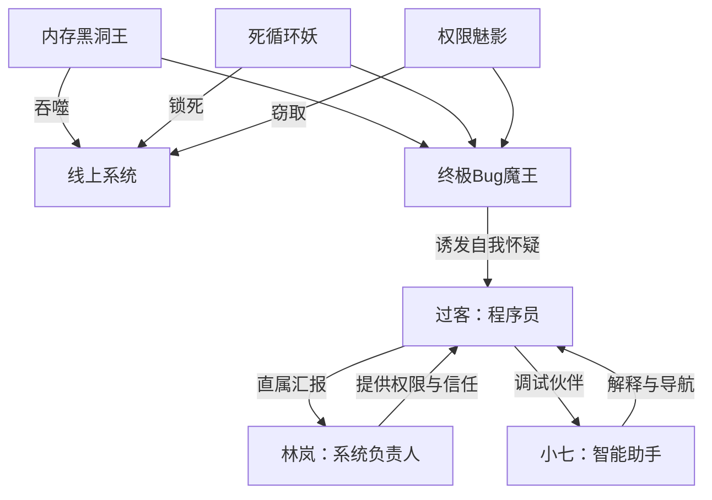

# 《大圣协议：程序员终极幻想》角色档案

## 一、主要角色

### 1. 过客

- **年龄：** 28岁
- **公开身份：** 互联网公司后端程序员
- **真实身份：** “大圣协议”唯一适配者，能够进入代码世界并读取系统根因
- **外貌与状态：** 黑眼圈、连帽衫、工牌不离身；现实中疲惫沉默，进入代码世界后化身金甲大圣
- **性格关键词：** 克制、聪明、嘴硬、负责、内心有火
- **核心动机：** 救回线上系统，也证明自己不是只会背锅的“螺丝钉”
- **最大冲突：** 习惯用补丁掩盖问题，不敢承认自己也害怕失败
- **爽点功能：** 从被质疑的普通人完成能力觉醒与身份碾压
- **语言特征：** 现实中惜字如金，战斗时一本正经地说程序员黑话
- **口头禅：** “先别慌，日志不会骗人。”

### 2. 林岚

- **年龄：** 30岁
- **公开身份：** 线上系统负责人、过客的直属主管
- **真实功能：** 现实世界的倒计时推动者，也是唯一相信过客判断的人
- **性格关键词：** 冷静、直接、护短、执行力强
- **核心动机：** 在系统彻底瘫痪前守住用户数据和团队声誉
- **与过客关系：** 从“你必须给结果”到“我相信你能找到根因”
- **爽点功能：** 代表现实世界见证过客翻盘，提供关键日志权限
- **关键台词：** “我不需要你保证没问题，我只需要你把真正的问题找出来。”

### 3. 小七

- **身份：** 过客的智能调试助手，代码世界中的“土地公”式导航程序
- **形象：** 一只戴工牌、抱键盘的小型金色猴形程序
- **性格关键词：** 毒舌、胆小、机灵、贪吃内存
- **核心功能：** 将专业技术概念转化成观众听得懂的神话规则
- **爽点功能：** 负责笑点、解释设定，并在关键时刻指出过客遗漏的日志
- **口头禅：** “这不是 Bug，这是系统在闹情绪。”

## 二、三大 Bug 魔头

### 1. 内存黑洞王

- **能力：** 吞噬数据、缓存和用户状态
- **外观：** 腹部像无底黑洞，身上挂满消失的代码碎片
- **动机：** 认为所有数据都应该归自己所有，吞得越多越强
- **反派台词：** “你们珍惜的数据，在我肚子里连一行日志都不配留下。”
- **击破方式：** 过客不再盲目清缓存，而是定位内存泄漏根因，用重构后的金箍棒封闭循环引用

### 2. 死循环妖

- **能力：** 无限分身、重复攻击、让同一段代码永远执行
- **外观：** 每说一句话就复制出一个自己，满屏都是相同表情
- **动机：** 痛恨变化，想让代码世界永远停留在“昨天能跑”的状态
- **反派台词：** “再来一次！再来一次！再来一次！你永远走不出这一行！”
- **击破方式：** 过客借筋斗云跳出循环节点，设置终止条件，让分身互相覆盖

### 3. 权限魅影

- **能力：** 隐身、窃取权限、伪造身份、操纵审计记录
- **外观：** 半透明黑雾，脸部只有一双不断变化的登录眼睛
- **动机：** 认为只要没有留下痕迹，就不存在责任
- **反派台词：** “没有日志，就没有罪证；没有身份，就没有我。”
- **击破方式：** 过客开启火眼金睛，从异常访问时间和权限链中锁定其真实路径

## 三、终极 Bug 魔王

- **来源：** 三大 Bug 的残骸，加上系统长期被掩盖的旧错误和人为甩锅记录
- **能力：** 同时吞噬数据、制造循环、篡改权限
- **核心动机：** 它不是单纯想毁灭系统，而是要证明“所有人都会选择掩盖错误”，因此系统永远不可能真正稳定
- **外观：** 巨型猿魔与服务器集群融合，胸口是一枚不断闪烁的红色根目录
- **核心台词：** “你以为你在修复我？我就是你们每一次不敢面对的真相。”
- **击破逻辑：** 过客承认错误存在，回溯日志、找到根因、重构代码，而不是简单删除表象

## 四、角色关系

## 五、三集角色弧线

- **过客：** 第1集被质疑、被迫背锅；第2集获得神话力量但仍依赖蛮力；第3集理解“根因优先”，完成真正成长。
- **林岚：** 第1集要求结果；第2集冒险开放根权限；第3集在现实世界为过客争取最后倒计时。
- **小七：** 从只会吐槽的辅助程序，成长为敢于冒险保存关键日志的可靠伙伴。
- **三大 Bug：** 从单体威胁升级为合体 Boss，最终暴露其共同本质：被掩盖的系统性错误。
